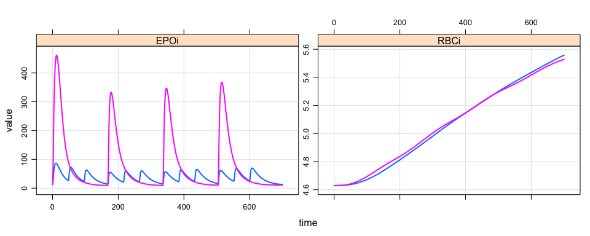
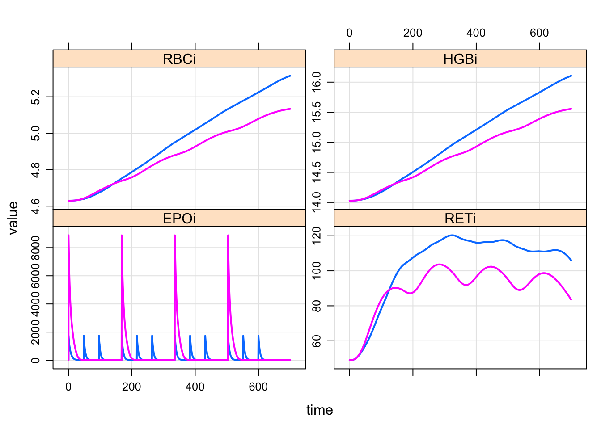
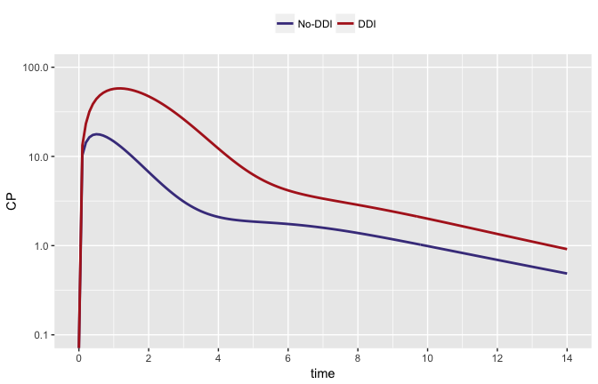
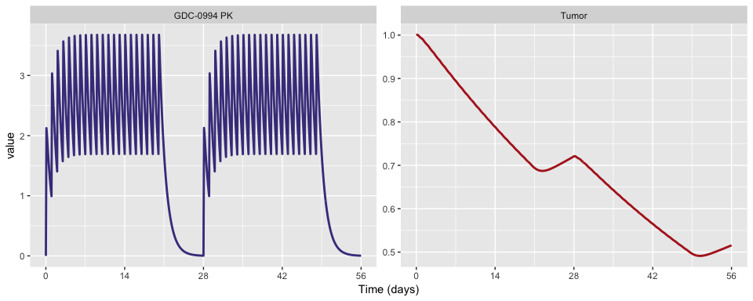

Presentation materials for July 2017 CIC event
==============================================

-   20 July 2017 Cambridge Innovation Center, Cambridge MA
-   Presentation slide deck: [index.pdf](index.pdf)

References
==========

The goal of this presentation was to translate and use models reported
in the literature. Accordingly, we note that we were not involved in
developing any of the models presented here, but acknowledge the authors
who not only did the scientific work, but published that work in a way
that allowed us to not only read about their models but to also use
those models.

 **Population Pharmacokinetic and Pharmacodynamic
Model- Based Comparability Assessment of a Recombinant Human Epoetin
Alfa and the Biosimilar HX575**

-   Xiaoyu Yan, MS, Philip J. Lowe, PhD, Martin Fink, PhD, Alexander
    Berghout, PhD, Sigrid Balser, PhD, and Wojciech Krzyzanski, PhD

-   J Clin Pharmacol. 2012 November ; 52(11): 1624–1644.
    <doi:10.1177/0091270011421911>.

-   [Model](content/model/epo.cpp), [R script](content/epo.R)

 **Quantitative Analyses of Hepatic OATP-Mediated
Interactions Between Statins and Inhibitors Using PBPK Modeling With a
Parameter Optimization Method**

-   T Yoshikado, K Yoshida, N Kotani, T Nakada, R Asaumi, K Toshimoto, K
    Maeda, H Kusuhara and Y Sugiyama

-   CLINICAL PHARMACOLOGY & THERAPEUTICS | VOLUME 100 NUMBER 5 |
    NOVEMBER 2016 <doi:10.1002/cpt.391>

-   [Model](content/model/yoshikado.cpp), [R simulation
    script](content/yoshikado.R), [Fit with minqa &
    RcppDE](content/fit.R), [Fit with MCMCpack](content/fit_mcmc.R)

 **Clinical responses to ERK inhibition in
BRAF{V600E}-mutant colorectal cancer predicted using a computational
model**

-   Daniel C. Kirouac, Gabriele Schaefer, Jocelyn Chan, Mark Merchant,
    Christine Orr, Shih-Min A. Huang, John Moffat, Lichuan Liu, Kapil
    Gadkar and Saroja Ramanujan

-   npj Systems Biology and Applications (2017) 3:14 ;
    <doi:10.1038/s41540-017-0016-1>

-   [Model](content/model/mapk.cpp), [R script](content/mapk.R),
    [Generate figure 6b](content/mapk_figure.R)

Examples
========

EPO Model ([Yan et al.](#epo))
------------------------------

    mod <- mread("epo", "content/model")

### QW dosing is equally effective as TIW dosing for SC but not IV administration

SC dosing

    tiw <- ev_days(ev(amt=7800,ID=1,rate=-2), days="m,w,f", addl=3)
    qd <- filter(tiw, time==0) %>% mutate(amt=40000,ID=2)

    data_sc <- bind_rows(tiw,qd)

    mod %>% zero_re %>% mrgsim(data=data_sc, end=700, delta=0.5) %>% 
      plot(EPOi+RBCi~time)

IV dosing

    data_iv <- mutate(data_sc, rate=0, cmt=2)

    mod %>% zero_re %>% mrgsim(data=data_iv, end=700, delta=0.5) %>% 
      plot(EPOi+RBCi~time)

OATP-DDI model ([Yoshikado et al.](#ddi))
-----------------------------------------

    mod <- mread("yoshikado", "content/model")

Simulate the DDI

    ddi <- c(ev(amt=2000, cmt=2, ID=1),
             ev(amt=30,   cmt=1, ID=1))

    ddi <- as.data.frame(ddi)
    no_ddi <- filter(ddi, amt==30) %>% mutate(ID=2)

    data <- bind_rows(no_ddi,ddi)

    out <- mod %>% mrgsim(data=data,end=14, delta=0.1)

Plot (code not shown)

ERI inhibition model ([Kirouac et al.](#erki))
----------------------------------------------

    mod <- mread("mapk", "content/model")
    vp <- read.csv("content/data/s10vpop.csv", header=TRUE) %>% slice(1)
    mod <- param(mod,vp) %>% init(vp)

Simulate to cycles of `GDC-0994` dosing

    data <- expand.ev(amt=400, cmt=12, time=c(0,28), ii=1, addl=20) %>% mutate(ID=1)

    out <- mrgsim(mod, data=data, end=56, delta=0.1, Req="GDC,TUMOR")

Plot (code not shown)

Implementation details
======================

R packages
----------

-   `dplyr`
-   `readr`
-   `MCMCpack`
-   `minqa`
-   `tidyr`
-   `ggplot2`
-   `purrr`
-   `purrlyr`
-   `mrgsolvetk`
-   `dmutate`

Special installation instructions
---------------------------------

Please be sure to install `mrgsolve`, `dmutate` and `mrgsolvetk` from
GitHub:

    devtools::install_github("metrumresearchgroup/mrgsolve")
    devtools::install_github("mrgsolve/mrgsolvetk")
    devtools::install_github("kylebmetrum/dmutate")
