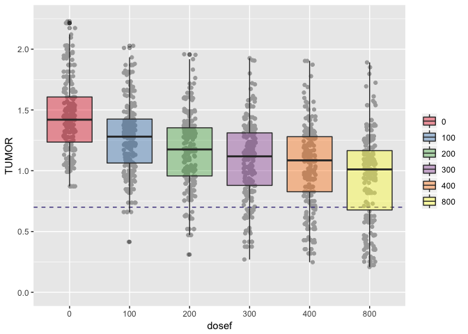
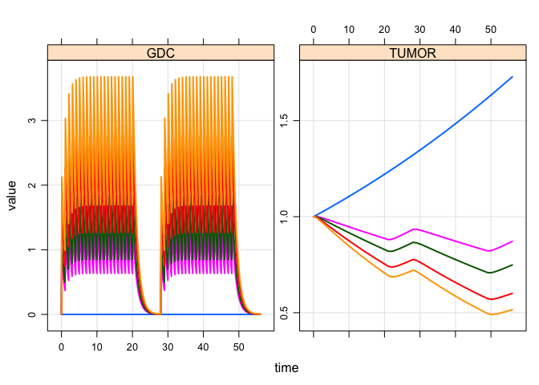
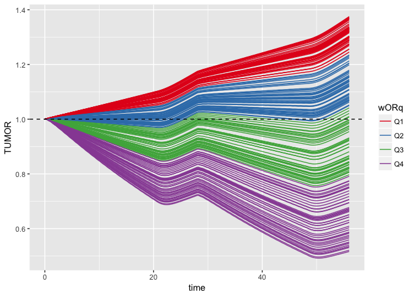

Reference
=========

-   Title
    -   *Clinical responses to ERK inhibition in BRAF{V600E}-mutant colorectal cancer predicted using a computational model*
-   Authors
    -   Daniel C. Kirouac, Gabriele Schaefer, Jocelyn Chan, Mark Merchant, Christine Orr, Shih-Min A. Huang, John Moffat, Lichuan Liu, Kapil Gadkar, Saroja Ramanujan
-   Citation
    -   npj Systems Biology and Applications, 3
    -   Article number: 14 (2017)
    -   doi: 10.1038/s41540-017-0016-1

Setup
=====

### Required packages

``` r
library(mrgsolve)
library(readr)
library(magrittr)
library(mrgsolvetk)
library(dplyr)
library(ggplot2)
source("src/functions.R")
```

### Load the model

``` r
mod <- mread("mapk", "model")
```

### Load in vpop dataset

-   This was provided in the supplementary material

``` r
vp <- read_csv("data/s10vpop.csv") %>% slice(1)
```

### Update parameters and initial conditions

``` r
mod %<>% param(vp) %>% init(vp) %>% update(end=56,delta=0.1)
```

Simple simulation scenario
--------------------------

-   `GDC-0994` is dosed 21 days on / 7 days off
-   We made a function to automate data set creation

``` r
dataG <- datag(400)
```

``` r
dataG
```

    . # A tibble: 2 x 7
    .     amt  time  evid   cmt    ID    ii  addl
    .   <dbl> <dbl> <dbl> <dbl> <int> <dbl> <dbl>
    . 1   400     0     1    12     1     1    20
    . 2   400    28     1    12     1     1    20

**Simulate**

``` r
out <- mrgsim(mod,data=dataG,obsonly=TRUE,Req="GDC,TUMOR")
```

-   `GDC` is the `TUMOR` `GDC-0994` concentration (partition coefficient=1; `ERKi`)
-   `TUMOR` is the `CELLS` compartment (renamed for clarity here)

``` r
out
```

    . Model:  mapk.cpp 
    . Dim:    561 x 4 
    . Time:   0 to 56 
    . ID:     1 
    .      ID time   GDC  TUMOR
    . [1,]  1  0.0 0.000 1.0000
    . [2,]  1  0.1 2.125 1.0007
    . [3,]  1  0.2 2.009 1.0006
    . [4,]  1  0.3 1.842 0.9999
    . [5,]  1  0.4 1.686 0.9988
    . [6,]  1  0.5 1.544 0.9975
    . [7,]  1  0.6 1.413 0.9962
    . [8,]  1  0.7 1.294 0.9949

**Plot**

``` r
plot(out)
```



Dose/response
-------------

``` r
dataG2 <- datag(amt=c(0,150,200,300,400))
out <- mrgsim(mod,data=dataG2,obsonly=TRUE,Req="GDC,TUMOR")
out
```

    . Model:  mapk.cpp 
    . Dim:    2805 x 4 
    . Time:   0 to 56 
    . ID:     5 
    .      ID time GDC TUMOR
    . [1,]  1  0.0   0 1.000
    . [2,]  1  0.1   0 1.001
    . [3,]  1  0.2   0 1.002
    . [4,]  1  0.3   0 1.003
    . [5,]  1  0.4   0 1.004
    . [6,]  1  0.5   0 1.005
    . [7,]  1  0.6   0 1.006
    . [8,]  1  0.7   0 1.007

``` r
plot(out)
```



Sensitivity analysis - `wOR`
----------------------------

-   MAPK pathway dependence (quantitative OR gate)
-   Tumors that respond well depend on MAPK signalling pathways
-   Simulate parameters from `uniform` distribution
-   Draw 200 values for `wOR` between `0.9` and `1`

``` r
.mod <- update(mod,events=as.ev(dataG,keep_id=FALSE),delta=0.25)

set.seed(2223)
out <- sens_unif(.mod, n=200, lower = 0.9, upper=1, 
                 pars="wOR",Req="GDC,TUMOR")

out %<>% mutate(wORq = cutq(wOR))

ggplot(out, aes(time,TUMOR,col=wORq,group=ID)) + 
  geom_line() + geom_hline(yintercept=1, lty=2) +
  .colSet1() 
```



Sensitivity analysis - `taui4`
------------------------------

-   Adding `30%` variability to `EC50`
-   Parameters from log-normal distribution

``` r
set.seed(3332)
out <- sens_norm(.mod, n=200, cv=30, pars="taui4",Req="GDC,TUMOR")

out %<>% mutate(taui4q = cutq(taui4))

ggplot(out, aes(time,TUMOR,col=taui4q,group=ID)) + 
  geom_line() + geom_hline(yintercept=1, lty=2) +
  .colSet1() 
```


Explore doses in the `vpop`
---------------------------

-   Focus on doses from `0` to `400 mg` QD in `21/7` cycle
-   Also simulate `800 mg` dose to see how much larger decrease in tumor size we can get
-   Sample from `vpop` using prevalence weights (`PW`)

``` r
set.seed(111)
vp <- read_csv("data/s10vpop.csv") %>% sample_n(250,replace=TRUE,weight=PW)
vp %<>% mutate(ID = 1:n())
data <- datag(1)
```

**A helper function**

``` r
sim <- function(dose) {
  data %<>% mutate(amt=dose)
  mrgsim(mod,idata=vp,events=as.ev(data,keep_id=FALSE),
         end=-1,add=56,obsonly=TRUE,Req="TUMOR") %>% mutate(dose=dose)
}
```

**Take advantage of parallelization provided by `R`**

``` r
library(parallel)
doses <- c(seq(0,400,100),800)
out <- mclapply(doses,sim)
```

**Simulate**

``` r
sims <- bind_rows(out) %>% mutate(dosef = nfact(dose))
```

**Plot**

``` r
ggplot(data=sims, aes(x=dosef,y=TUMOR)) + 
  geom_point(position=position_jitter(width=0.1),col="darkgrey") +
  geom_hline(yintercept=0.7,col="darkslateblue",lty=2) + 
  geom_boxplot(aes(fill=dosef),alpha=0.4) + ylim(0,2.25) +
  .fillSet1(name="")
```


### Summary

``` r
sims %>% 
  group_by(dosef) %>%
  summarise(med=median(TUMOR), R30 = mean(TUMOR < 0.7))
```

    . # A tibble: 6 x 3
    .    dosef      med   R30
    .   <fctr>    <dbl> <dbl>
    . 1     0  1.419783 0.000
    . 2   100  1.280410 0.020
    . 3   200  1.174990 0.068
    . 4   300  1.118242 0.120
    . 5   400  1.085246 0.164
    . 6   800  1.010725 0.252
