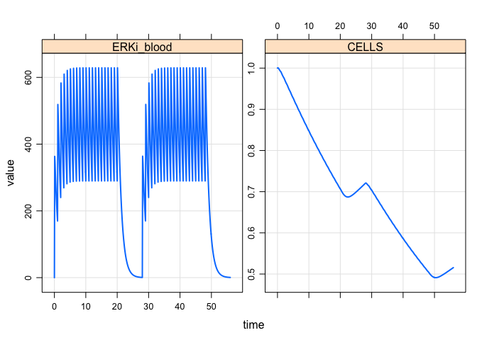
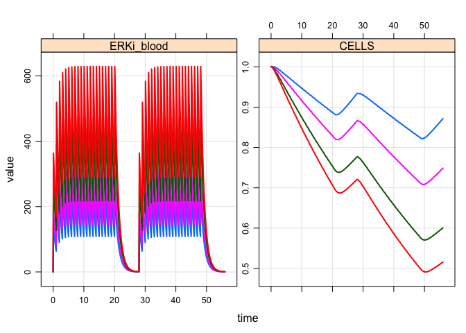
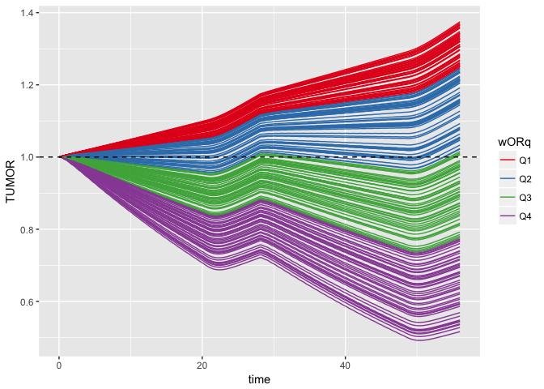
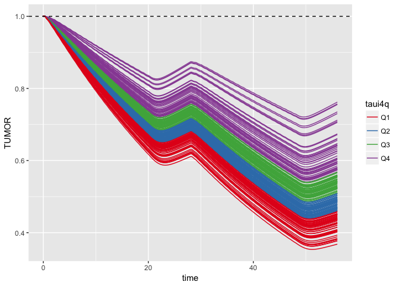
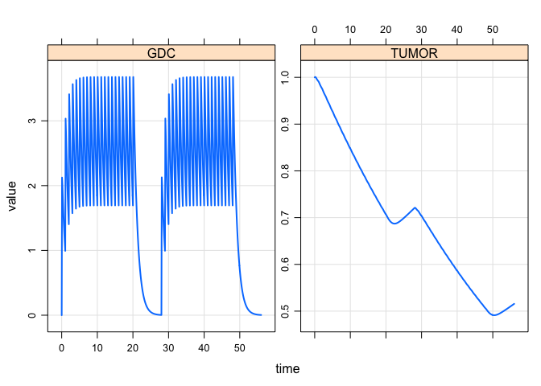

Update parameters and initial conditions

``` r
mod %<>% param(vp) %>% init(vp) %>% update(end=56,delta=0.1)
```

Create a data set

``` r
dataG <- datag(400)

out <- mrgsim(mod,data=dataG,obsonly=TRUE,Req="ERKi_blood,CELLS")
out
```

    . Model:  mapk.cpp 
    . Dim:    561 x 4 
    . Time:   0 to 56 
    . ID:     1 
    .      ID time ERKi_blood  CELLS
    . [1,]  1  0.0        0.0 1.0000
    . [2,]  1  0.1      363.3 1.0007
    . [3,]  1  0.2      343.6 1.0006
    . [4,]  1  0.3      314.9 0.9999
    . [5,]  1  0.4      288.3 0.9988
    . [6,]  1  0.5      264.0 0.9975
    . [7,]  1  0.6      241.7 0.9962
    . [8,]  1  0.7      221.3 0.9949

``` r
plot(out)
```



Dose/response

``` r
dataG2 <- datag(amt=c(150,200,300,400))
out <- mrgsim(mod,data=dataG2,obsonly=TRUE,Req="ERKi_blood,CELLS")
out
```

    . Model:  mapk.cpp 
    . Dim:    2244 x 4 
    . Time:   0 to 56 
    . ID:     4 
    .      ID time ERKi_blood  CELLS
    . [1,]  1  0.0       0.00 1.0000
    . [2,]  1  0.1     136.24 1.0008
    . [3,]  1  0.2     128.85 1.0010
    . [4,]  1  0.3     118.09 1.0008
    . [5,]  1  0.4     108.13 1.0005
    . [6,]  1  0.5      99.00 1.0002
    . [7,]  1  0.6      90.64 1.0000
    . [8,]  1  0.7      82.98 0.9999

``` r
plot(out)
```



Sensitivity analysis - wOR

``` r
.mod <- update(mod,events=as.ev(dataG,keep_id=FALSE))

out <- sens_unif(.mod, n=200, lower = 0.9, upper=1, pars="wOR",Req="ERKi_blood,TUMOR")
out %<>% mutate(wORq = cutq(wOR))

ggplot(out, aes(time,TUMOR,col=wORq,group=ID)) + 
  geom_line() + geom_hline(yintercept=1, lty=2) +
  .colSet1() 
```



Sensitivity analysis - taui4
============================

-   Adding 30% variability to IC50

``` r
.mod <- update(mod,events=as.ev(dataG,keep_id=FALSE))

out <- sens_norm(.mod, n=200, cv=30, pars="taui4",Req="ERKi_blood,TUMOR")

out %<>% mutate(taui4q = cutq(taui4))


ggplot(out, aes(time,TUMOR,col=taui4q,group=ID)) + 
  geom_line() + geom_hline(yintercept=1, lty=2) +
  .colSet1() 
```



Explore doses in the vpop

``` r
set.seed(111)
vp <- read_csv("data/s10vpop.csv") %>% sample_n(250,replace=TRUE,weight=PW)
vp %<>% mutate(ID = 1:n())
data <- datag(1)

sim <- function(dose) {
  data %<>% mutate(amt=dose)
  mrgsim(mod,idata=vp,events=as.ev(data,keep_id=FALSE),
         end=-1,add=56,obsonly=TRUE,Req="TUMOR") %>% mutate(dose=dose)
}

library(parallel)
out <- mclapply(seq(0,400,100),sim)

sims <- bind_rows(out)

ggplot(data=sims, aes(x=factor(dose),y=TUMOR)) + 
  geom_point(position=position_jitter(width=0.1),col="darkgrey") +
  geom_hline(yintercept=0.7,col="firebrick") + 
  geom_boxplot(fill=NA) + ylim(0,2.25)
```



``` r
sims %>% 
  group_by(dose) %>%
  summarise(med=median(TUMOR), R30 = mean(TUMOR < 0.7))
```

    . # A tibble: 5 x 3
    .    dose      med   R30
    .   <dbl>    <dbl> <dbl>
    . 1     0 1.419783 0.000
    . 2   100 1.280410 0.020
    . 3   200 1.174990 0.068
    . 4   300 1.118242 0.120
    . 5   400 1.085246 0.164
